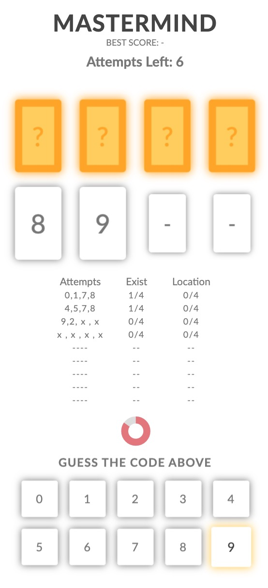
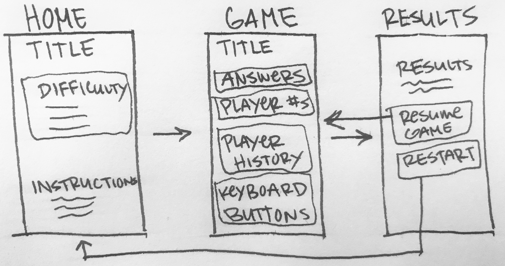

<div align='center'>
<h1>Mastermind</h1>
Mastermind is a game where players have 10 attempts to guess the location of 4 numbers

&nbsp;


[Play Game](https://kevinreber.github.io/mastermind-game/)

[Source Code](https://github.com/kevinreber/mastermind-game)

</div>

## Installation Requirements

### Node

To run npm/yarn, you will need Node.js. You can go on [official Node.js website](https://nodejs.org/en/download) and download the installer.

If the installation was successful, you should be able to run the following command.

```bash
$ node -v                       # check if node is installed
  v10.16.0                      # version number
$ npm -v                        # check if npm is installed
  6.14.12                       # version number
```

## Setup

After downloading node/npm, you should be able to run the following:

### Clone Repository

```
$ cd [workspace directory]
$ git clone https://github.com/kevinreber/mastermind-game.git
```

### Run Program

```
$ cd mastermind-game
$ npm install
$ npm start
```

Open [http://localhost:3000](http://localhost:3000) to view project in the browser.

## How to Play

<div align='center'>

</div>

- Player selects a difficulty.
- Player has 10 attempts to guess the location of 4 numbers in limited time.
- After each attempt player has 10 seconds to view their results.
- Game ends when player runs out of attempts or matches all numbers.

## <a id="difficulty"></a>Difficulty levels

- <strong>Easy</strong> - Timer: 30 seconds, Keyboard Numbers: 0-5
- <strong>Medium</strong> - Timer: 25 seconds, Keyboard Numbers: 0-7
- <strong>Hard</strong> - Timer: 20 seconds, Keyboard Numbers: 0-9

## Goals

- Display how many attempts player has.
- Generate 4 random integers using [Random.Org API](https://www.random.org/clients/http/api/).
- Numbers must be between 0-7.
- Player need a way to guess 4 random numbers - make keyboard for mobile users.
- Results need to be shown after Player has made 4 guesses.
- Player needs a way to continue game after results displayed.
- Number of attempts needs to be updated each turn.
- Player must have a way to view previous results.
- Notify player when game is over.

## Wireframes

<div align='center'>
    
</div>

- Minimalist approach
- Desktop & Mobile friendly
- Reveal answers when game is over

## Game Rules

- Player is only allowed 4 guesses per attempt.
- Game is not over until player has matched all 4 random numbers or player has 0 attempts left.
- Player who has matched all 4 random numbers in the least amount of attempts has their number of attempts stored in "Best Score"

## Extensions Implemented

- Difficulty Levels
- Instructions
- Timer
- Animations
- Media Queries

## Extensions To Add/Improve

- Local Storage
- Show player history on Results Screen
- Improve animations
- Sound
- Different design for desktop

## Built With

- [Sass](https://sass-lang.com/install) - CSS preprocessor
- [Axios](https://github.com/axios/axios) - Promise based HTTP client for the browser and node.js
- [React.js](https://reactjs.org/) - Javascript Framework
- [Random.Org](https://www.random.org/clients/http/api/) - Random number generator API

## Authors

- Kevin Reber &nbsp; [Github](https://github.com/kevinreber) &nbsp; | &nbsp; [Portfolio](https://kevinreber.github.io/kevin-reber-portfolio/)
